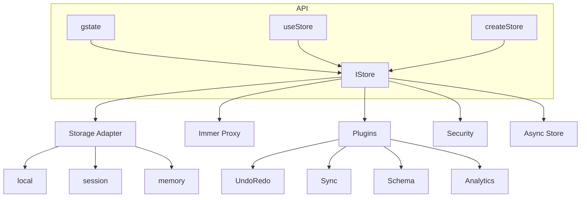

# Argis (RGS) - Reactive Global State

> "The Magnetar" **Atomic Precision. Immutable Safety. Zen Simplicity.**
> The most powerful state management engine for React. Built for those who demand industrial-grade reliability with a zero-boilerplate experience.

[](https://opensource.org/licenses/MIT)
[](https://npmjs.org/package/@biglogic/rgs)
[](https://npmjs.org/package/@biglogic/rgs)


<!-- [](https://a51.gitbook.io/rgs) -->

---

## 🌟 Why Magnetar?

We took the simplicity of **Reactive Global State (RGS)** and fused it with the architecture of a **High-Performance Kernel**. It's the only library that gives you:

- **💎 Absolute Immutability**: Powered by **Immer**. No more manual spreads. State is frozen by default.
- **🛡️ Industrial-Grade Safety**: Deep Proxy guards that throw `Forbidden Mutation` errors if you try to bypass the kernel.
- **🔌 Enterprise Ecosystem**: A real plugin architecture with 10+ official modules (Sync, Storage, DevTools, etc.).
- **⚛️ Power on Demand**: Advanced async and persistence tools isolated in the `advanced` export.
- **🏗️ Stellar Architecture**: Zero circular dependencies. Modular, clean, and 100% type-safe.

---

## gState vs useState

| Feature | RGS gState | React useState |
|---------|--------|----------|
| **Global state across components** | ✅ Automatic sharing | ❌ Need Context/props |
| **Provider wrapper** | ✅ Not needed | ❌ Required |
| **Persistence (localStorage)** | ✅ Built-in | ❌ Manual |
| **Data encryption** | ✅ AES-256-GCM | ❌ |
| **Multiple namespaces/stores** | ✅ | ❌ |
| **Plugins (Immer, Undo/Redo)** | ✅ | ❌ |
| **Audit logging** | ✅ | ❌ |
| **RBAC/GDPR consent** | ✅ | ❌ |
| **SSR/Hydration** | ✅ Automatic | ❌ Manual |
| **Computed values** | ✅ | ❌ |

### When to use what?

- **useState**: Local UI, single component, temporary state
- **gState**:
  - Shared state across multiple components
  - Persistent data (preferences, cart, authentication)
  - Sensitive data (encryption)
  - Advanced features (undo/redo, snapshots)
  - Enterprise (audit, RBAC, GDPR)

---

## ⚔️ The Arena: RGS vs The World

|Feature|**RGS (Argis)**|Zustand|Redux Toolkit|Recoil|
|:---|:---|:---|:---|:---|
| **Philosophy** | **Zen State** | Minimalist | Enterprise Flux | Atomic |
| **API Surface** | **1 Function** | Simple | Complex | Complex |
| **Mutations** | **Magic (Immer)** | Manual Spreads | Magic (Immer) | Manual |
| **Selectors** | ✅ **Type-Safe** | ✅ Functional | ✅ Functional | ⚠️ Selectors |
| **Security** | 🛡️ **AES-256 + RBAC** | ❌ None | ❌ Ecosystem | ❌ None |
| **Persistence** | 💾 **First-class** | 🔌 Middleware | 🔌 Middleware | 🔌 Effects |
| **Async** | ✅ **Atomic** | ✅ Async/Await | ✅ Thunks | ✅ Suspense |
| **Bundle Size** | **~2kB** | ~1kB | >10kB | >20kB |

> **RGS** is the only library on the market that treats **Security** and **Persistence** as first-class citizens.

---

### Installation

```shell
npm install @biglogic/rgs
```

---

### Examples and guide

**[github.com/BigLogic-ca/rgs](https://github.com/BigLogic-ca/rgs)**

---

## 🏗️ Architecture



### Core Components

| Component | Description |
|-----------|-------------|
| **gstate()** | Creates store + hook in one line |
| **useStore()** | React hook for subscribing to state |
| **createStore()** | Classic store factory |
| **IStore** | Core interface with get/set/subscribe |
| **StorageAdapters** | local, session, memory persistence |
| **Plugins** | Immer, Undo/Redo, Sync, Schema, etc. |
| **Security** | Encryption, RBAC, GDPR consent |

---

## Requirements

- **React 16.8+** (for hooks support)
- **React DOM**

## ⚡ Zero-Boilerplate Quickstart

### Path A: The Zen Way (Modular)

Best for modern applications. Clean imports, zero global pollution, **Type-Safe**.

```tsx
import { gstate } from '@biglogic/rgs'

// 1. Create a typed store hook
const useCounter = gstate({ count: 0, user: { name: 'Alice' } })

// 2. Use with Type-Safe Selectors (Preferred)
const count = useCounter(state => state.count)
const userName = useCounter(state => state.user.name)

// OR use string keys (Legacy)
const [count, setCount] = useCounter('count')
```

### Path B: The Classic Way (Global)

Best for shared state across the entire application.

```tsx
// 1. Initialize once
import { initState, useStore } from '@biglogic/rgs'
initState({ namespace: 'app' })

// 2. Use anywhere
const [user, setUser] = useStore('user')
```

---

## 📚 Quick Examples

```tsx
const store = gstate({ theme: 'dark' }, "my-app")
```

### Encryption

```tsx
const secureStore = gstate({ token: 'xxx' }, { encoded: true })
```

### Undo/Redo

```tsx
const store = gstate({ count: 0 })
store._addPlugin(undoRedoPlugin({ limit: 50 }))

store.undo()
store.redo()
```

### Cross-Tab Sync

```tsx
const store = gstate({ theme: 'light' })
store._addPlugin(syncPlugin({ channelName: 'my-app' }))
```

```tsx
const store = gstate({ firstName: 'John', lastName: 'Doe' })
store.compute('fullName', (get) => `${get('firstName')} ${get('lastName')}`)

const [fullName] = store('fullName') // "John Doe"
```

### Error Handling with onError

Handle errors gracefully with the `onError` callback - perfect for production apps:

```tsx
const store = gstate({ data: null }, {
  onError: (error, context) => {
    console.error(`Error in ${context.operation}:`, error.message)
    // Send to error tracking service (Sentry, etc.)
  }
})
```

### Size Limits (maxObjectSize & maxTotalSize)

Protect your app from memory issues with automatic size warnings:

```tsx
const store = gstate({ data: {} }, {
  // Warn if single value exceeds 5MB (Default is 0/Disabled for performance)
  maxObjectSize: 5 * 1024 * 1024,
  // Warn if total store exceeds 50MB (Default is 0/Disabled)
  maxTotalSize: 50 * 1024 * 1024
})
```

---

## Multiple Stores

You can create multiple independent stores using namespaces:

```tsx
// Option 1: gstate with namespace
const userStore = gstate({ name: 'John' }, { namespace: 'users' })
const appStore = gstate({ theme: 'dark' }, { namespace: 'app' })

// In components - same key, different stores
const [name] = userStore('name')     // 'John'
const [theme] = appStore('theme')    // 'dark'

// Option 2: initState + useStore (global default store)
initState({ namespace: 'global' })
const [value, setValue] = useStore('key')
```

**Tip**: Keys are unique per-namespace, so you can use the same key name in different stores.

## 🚀 Advanced Superpowers

### 🔌 Official Plugin Ecosystem

Extend the core functionality dynamically with specialized modules.

1. **ImmerPlugin**: Adds `setWithProduce` for functional updates.
2. **UndoRedoPlugin**: Multi-level history management.
3. **PersistencePlugin**: Advanced storage with custom serialization.
4. **SyncPlugin**: Cross-tab state synchronization via BroadcastChannel.
5. **SchemaPlugin**: Runtime validation (perfect for Zod).
6. **DevToolsPlugin**: Redux DevTools integration.
7. **TTLPlugin**: Time-to-live management.
8. **AnalyticsPlugin**: Tracking bridge for metrics.
9. **SnapshotPlugin**: Manual state checkpointing.
10. **GuardPlugin**: Data transformation layer.

```typescript
import { createStore, PersistencePlugin, undoRedoPlugin } from '@biglogic/rgs'

const store = createStore()
store._addPlugin(PersistencePlugin({ storage: 'localStorage' }))
store._addPlugin(undoRedoPlugin({ limit: 50 }))

// Undo like a pro
store.undo()
```

### 🔬 Power Tools (Import from `rgs/advanced`)

Need the heavy artillery? We've got you covered.

- `createAsyncStore(fetcher)`: Atomic async state management.
- `StorageAdapters`: High-level interfaces for any storage engine.
- `Middleware / IPlugin`: Build your own extensions.

---

## 🛡️ Quality & Testing

RGS is built with an obsession for reliability. Our test suite covers multiple layers to ensure zero-regressions:

- **Unit Tests (Jest)**: 100+ tests covering core logic, stores, and hooks.
- **E2E Tests (Playwright)**: Real-world browser testing for cross-tab synchronization and Web Crypto API.
- **Concurrency Testing**: Verification of race conditions in multi-tab environments.

```bash
# Run unit tests
npm run test

# Run E2E tests
npm run test:e2e
```

---

## 📄 License

MIT © [Dario Passariello](https://github.com/dpassariello)

---

**Designed for those who build the future.**
Made with ❤️ and a lot of caffe' espresso!
