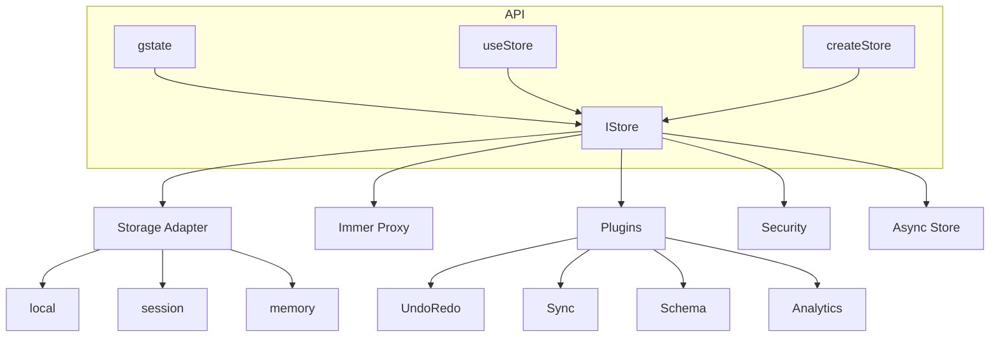

# Argis (RGS) - React Globo State "The Magnetar"

> **Atomic Precision. Immutable Safety. Zen Simplicity.**
> The most powerful state management engine for React. Built for those who demand industrial-grade reliability with a zero-boilerplate experience.

[](https://badge.fury.io/js/rgs)
[](https://opensource.org/licenses/MIT)

---

## 🌟 Why Magnetar?

We took the simplicity of **React Globo State (RGS)** and fused it with the architecture of a **High-Performance Kernel**. It's the only library that gives you:

- **💎 Absolute Immutability**: Powered by **Immer**. No more manual spreads. State is frozen by default.
- **🛡️ Industrial-Grade Safety**: Deep Proxy guards that throw `Forbidden Mutation` errors if you try to bypass the kernel.
- **🔌 Enterprise Ecosystem**: A real plugin architecture with 10+ official modules (Sync, Storage, DevTools, etc.).
- **⚛️ Power on Demand**: Advanced async and persistence tools isolated in the `advanced` export.
- **🏗️ Stellar Architecture**: Zero circular dependencies. Modular, clean, and 100% type-safe.

---

## gState vs useState

| Feature | useState | gState |
|---------|----------|--------|
| **Global state across components** | ❌ Need Context/props | ✅ Automatic sharing |
| **Provider wrapper** | ❌ Required | ✅ Not needed |
| **Persistence (localStorage)** | ❌ Manual | ✅ Built-in |
| **Data encryption** | ❌ | ✅ AES-256-GCM |
| **Multiple namespaces/stores** | ❌ | ✅ |
| **Plugins (Immer, Undo/Redo)** | ❌ | ✅ |
| **Audit logging** | ❌ | ✅ |
| **RBAC/GDPR consent** | ❌ | ✅ |
| **SSR/Hydration** | ❌ Manual | ✅ Automatic |
| **Computed values** | ❌ | ✅ |

### When to use what?

- **useState**: Local UI, single component, temporary state
- **gState**:
  - Shared state across multiple components
  - Persistent data (preferences, cart, authentication)
  - Sensitive data (encryption)
  - Advanced features (undo/redo, snapshots)
  - Enterprise (audit, RBAC, GDPR)

---

## 🏗️ Architecture



### Core Components

| Component | Description |
|-----------|-------------|
| **gstate()** | Creates store + hook in one line |
| **useStore()** | React hook for subscribing to state |
| **createStore()** | Classic store factory |
| **IStore** | Core interface with get/set/subscribe |
| **StorageAdapters** | local, session, memory persistence |
| **Plugins** | Immer, Undo/Redo, Sync, Schema, etc. |
| **Security** | Encryption, RBAC, GDPR consent |

---

## Requirements

- **React 16.8+** (for hooks support)
- **React DOM**

## ⚡ Zero-Boilerplate Quickstart

### Path A: The Zen Way (Modular)

Best for modern applications. Clean imports, zero global pollution.

```tsx
import { gstate } from '@biglogic/rgs'

// gstate CREATES a custom hook - it is NOT imported!
const useCounter = gstate({ count: 0 })

// In your component
const [count, setCount] = useCounter('count')
```

### Path B: The Classic Way (Global)

Best for shared state across the entire application.

```tsx
// 1. Initialize once
import { initState, useStore } from '@biglogic/rgs'
initState({ namespace: 'app' })

// 2. Use anywhere
const [user, setUser] = useStore('user')
```

---

## 📚 Quick Examples

### Persistence

```tsx
const store = gstate({ theme: 'dark' }, { persist: true })
```

### Encryption

```tsx
const secureStore = gstate({ token: 'xxx' }, { encoded: true })
```

### Undo/Redo

```tsx
const store = gstate({ count: 0 })
store._addPlugin(undoRedoPlugin({ limit: 50 }))

store.undo()
store.redo()
```

### Cross-Tab Sync

```tsx
const store = gstate({ theme: 'light' })
store._addPlugin(syncPlugin({ channelName: 'my-app' }))
```

### Computed Values

```tsx
const store = gstate({ firstName: 'John', lastName: 'Doe' })
store.compute('fullName', ['firstName', 'lastName'],
  (s) => `${s.firstName} ${s.lastName}`)

const [fullName] = store('fullName') // "John Doe"
```

---

## Multiple Stores

You can create multiple independent stores using namespaces:

```tsx
// Option 1: gstate with namespace
const userStore = gstate({ name: 'John' }, { namespace: 'users' })
const appStore = gstate({ theme: 'dark' }, { namespace: 'app' })

// In components - same key, different stores
const [name] = userStore('name')     // 'John'
const [theme] = appStore('theme')    // 'dark'

// Option 2: initState + useStore (global default store)
initState({ namespace: 'global' })
const [value, setValue] = useStore('key')
```

**Tip**: Keys are unique per-namespace, so you can use the same key name in different stores.

## 🚀 Advanced Superpowers

### 🔌 Official Plugin Ecosystem

Extend the core functionality dynamically with specialized modules.

1. **ImmerPlugin**: Adds `setWithProduce` for functional updates.
2. **UndoRedoPlugin**: Multi-level history management.
3. **PersistencePlugin**: Advanced storage with custom serialization.
4. **SyncPlugin**: Cross-tab state synchronization via BroadcastChannel.
5. **SchemaPlugin**: Runtime validation (perfect for Zod).
6. **DevToolsPlugin**: Redux DevTools integration.
7. **TTLPlugin**: Time-to-live management.
8. **AnalyticsPlugin**: Tracking bridge for metrics.
9. **SnapshotPlugin**: Manual state checkpointing.
10. **GuardPlugin**: Data transformation layer.

```typescript
import { createStore, PersistencePlugin, undoRedoPlugin } from '@biglogic/rgs'

const store = createStore()
store._addPlugin(PersistencePlugin({ storage: 'localStorage' }))
store._addPlugin(undoRedoPlugin({ limit: 50 }))

// Undo like a pro
store.undo()
```

### 🔬 Power Tools (Import from `rgs/advanced`)

Need the heavy artillery? We've got you covered.

- `createAsyncStore(fetcher)`: Atomic async state management.
- `StorageAdapters`: High-level interfaces for any storage engine.
- `Middleware / IPlugin`: Build your own extensions.

---

## 📄 License

MIT © [Dario Passariello](https://github.com/dpassariello)

---

**Designed for those who build the future.**
Made with ❤️ and a lot of caffe' espresso!
