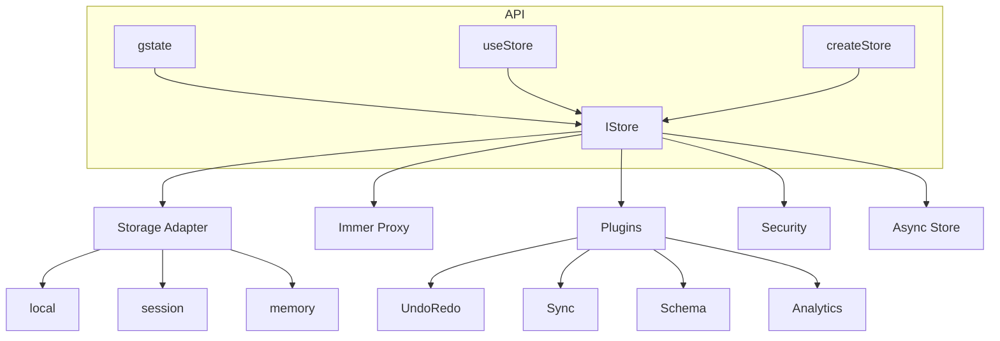

# 🚀 ARGIS (RGS) - Reactive Global State

> **"Atomic Precision. Immutable Safety. Zen Simplicity."**
> The state management engine that **won't let you fail**.

[](https://npmjs.org/package/@biglogic/rgs)
[](https://npmjs.org/package/@biglogic/rgs)
[](https://opensource.org/licenses/MIT)
[](https://www.typescriptlang.org/)
[](https://react.dev/)

> **🔐 Security Compliance**: This project is fully compliant with **NIST SP 800-132** standards for password-based key derivation, featuring AES-256-GCM encryption, PBKDF2 with 600k iterations, and 32-byte salts.

---

## ⚡ TL;DR

>Why ARGIS (RGS) Will Change How You Code Forever

```tsx
// One line. Zero boilerplate. Enterprise-grade power.
const useUser = gstate({
  name: 'Alice',
  cart: [],
  preferences: { theme: 'dark' }
})

// That's it. Use it anywhere:
const name = useUser(s => s.name)
const theme = useUser(s => s.preferences.theme)

// Mutations? Just write it. Immer handles immutability automatically.
useUser(s => {
  s.cart.push({ id: 1, item: 'Coffee Machine', price: 99 })
})
```

**Stop fighting your state management. Start building.**

---

## 🎯 Why Developers Are **Obsessed** With ARGIS (RGS)

| Feature | Other Libraries | ARGIS (RGS) |
|---------|----------------|--------------|
| **API Complexity** | 10+ functions, providers, reducers | **1 function** - `gstate()` |
| **Immutability** | Manual spreads, Redux boilerplate | **Automatic** - Powered by Immer |
| **Security** | None | **AES-256 + RBAC + GDPR** built-in |
| **Persistence** | Manual localStorage/sessionStorage | **First-class** - Auto-save anywhere |
| **Offline/Cloud Sync** | Non-existent | **Local-First + Cloud Sync** included |
| **Bundle Size** | 10-50KB+ | **~2KB** minimal / **~32KB** full |
| **Type Safety** | Partial | **100% TypeScript** out of the box |

### 🔥 The Truth About State Management

Most libraries make you **choose** between:
- ✗ Simplicity vs Power
- ✗ Security vs Speed
- ✗ Offline vs Cloud

**ARGIS (RGS) gives you ALL of it.**

---

## 🏆 RGS vs The Competition

| Feature | **RGS (Argis)** | Zustand | Redux Toolkit | Recoil | Jotai |
|---------|:---:|:---:|:---:|:---:|:---:|
| **Philosophy** | Zen State | Minimalist | Enterprise Flux | Atomic | Atomic |
| **API Surface** | **1 Function** | Simple | Complex | Complex | Simple |
| **Mutations** | **Magic (Immer)** | Manual | Magic | Manual | Manual |
| **Security** | 🛡️ **AES-256 + RBAC** | ❌ | ❌ | ❌ | ❌ |
| **Persistence** | 💾 **First-class** | 🔌 | 🔌 | 🔌 | 🔌 |
| **Local-First Sync** | ✅ **Built-in** | ❌ | ❌ | ❌ | ❌ |
| **Bundle Size** | **~2KB/32KB** | ~1KB | >10KB | >20KB | ~3KB |

> **RGS is the ONLY library treating Security and Persistence as first-class citizens.**

---

## 🚀 Installation

```bash
# The fastest way to upgrade your React app
npm install @biglogic/rgs
```

```bash
# Or with pnpm
pnpm add @biglogic/rgs

# Or with yarn
yarn add @biglogic/rgs
```

---

## 🎮 Quick Start - 30 Seconds to Glory

### The Zen Way (Recommended)

```tsx
import { gstate } from '@biglogic/rgs'

// ONE line creates a typed store hook
const useStore = gstate({
  count: 0,
  user: { name: 'Alice', email: 'alice@example.com' }
})

function Counter() {
  // Type-safe selectors - the React way
  const count = useStore(s => s.count)
  const userName = useStore(s => s.user.name)

  // Direct mutations - just write JavaScript
  const increment = () => useStore(s => { s.count++ })

  return (
    <div>
      <h1>Hello, {userName}!</h1>
      <p>Count: {count}</p>
      <button onClick={increment}>+1</button>
    </div>
  )
}
```

### The Classic Way (Global Store)

```tsx
import { initState, useStore } from '@biglogic/rgs'

// Initialize once at app root
initState({ namespace: 'myapp' })

// Use anywhere in your app
const [user, setUser] = useStore('user')
const [theme, setTheme] = useStore('theme')
```

---

## 🛡️ Enterprise-Grade Security (No Extra Code)

### AES-256-GCM Encryption

```tsx
// Your sensitive data is encrypted automatically
const useAuth = gstate({
  token: 'jwt-token-here',
  refreshToken: 'refresh-token'
}, { encoded: true })  // 🔐 AES-256-GCM encryption enabled
```

### RBAC (Role-Based Access Control)

```tsx
const store = gstate({
  adminPanel: { users: [], settings: {} },
  userProfile: {}
}, {
  rbac: {
    admin: ['adminPanel', 'userProfile'],
    user: ['userProfile'],
    guest: []
  }
})

// Only admins can touch adminPanel
store.set('adminPanel', { users: ['new'] }) // ✅ Works for admins
```

### GDPR Compliance

```tsx
// Export all user data (GDPR requirement)
store.exportData()  // Returns JSON of all stored data

// Delete all user data (GDPR "right to be forgotten")
store.deleteData()
```

---

## 💾 Persistence That Just Works

### Built-in Storage Adapters

```tsx
// localStorage (default) - survives browser restart
const useSettings = gstate({ theme: 'dark' }, { persist: true })

// sessionStorage - survives page refresh but not tab close
const useSession = gstate({ temporary: 'data' }, { storage: 'session' })

// Memory only - for ephemeral data
const useMemory = gstate({ cache: [] }, { storage: 'memory' })

// IndexedDB - for GB-scale data
const useBigData = gstate({ dataset: [] })
store._addPlugin(indexedDBPlugin({ dbName: 'my-app-db' }))
```

---

## 🔌 Plugins Ecosystem - Extend Without Limits

RGS comes with **11+ official plugins** ready to supercharge your app:

| Plugin | Purpose | One-Liner |
|--------|---------|-----------|
| `undoRedoPlugin` | Time travel through state | `store.undo()` / `store.redo()` |
| `syncPlugin` | Cross-tab sync (no server) | `store._addPlugin(syncPlugin(...))` |
| `indexedDBPlugin` | GB-scale storage | `store._addPlugin(indexedDBPlugin(...))` |
| `cloudSyncPlugin` | Cloud backup & sync | `store.plugins.cloudSync.sync()` |
| `devToolsPlugin` | Redux DevTools | `store._addPlugin(devToolsPlugin(...))` |
| `immerPlugin` | Mutable-style updates | `store.setWithProduce('key', fn)` |
| `snapshotPlugin` | Save/restore checkpoints | `store.takeSnapshot('backup')` |
| `schemaPlugin` | Runtime validation | `store._addPlugin(schemaPlugin(...))` |
| `guardPlugin` | Transform on set | `store._addPlugin(guardPlugin(...))` |
| `analyticsPlugin` | Track changes | `store._addPlugin(analyticsPlugin(...))` |
| `debugPlugin` | Console access (DEV) | `window.gstate.list()` |

### Undo/Redo - Never Lose Work

```tsx
import { undoRedoPlugin } from '@biglogic/rgs'

const store = gstate({ text: '' })
store._addPlugin(undoRedoPlugin({ limit: 50 }))

// User makes changes...
store.set('text', 'Hello World')
store.set('text', 'Hello Universe')

// Oops! Let's go back
store.undo()  // Returns to 'Hello World'
store.redo()   // Returns to 'Hello Universe'
```

### Cross-Tab Sync - Real-Time Everywhere

```tsx
import { syncPlugin } from '@biglogic/rgs/advanced'

const store = gstate({ theme: 'light' })
store._addPlugin(syncPlugin({ channelName: 'my-app' }))

// Change in Tab 1 → Instantly updates Tab 2, Tab 3, etc.
// ZERO server calls. Pure browser magic.
```

### Cloud Sync - Your Data, Everywhere

```tsx
import { cloudSyncPlugin, createMongoAdapter } from '@biglogic/rgs/advanced'

const adapter = createMongoAdapter(
  'https://data.mongodb-api.com/...',
  'your-api-key'
)

const store = gstate({ todos: [] })
store._addPlugin(cloudSyncPlugin({
  adapter,
  autoSyncInterval: 30000  // Every 30 seconds
}))

// Manual sync when needed
await store.plugins.cloudSync.sync()
```

---

## ☁️ Local-First Sync - Offline by Default

The **killer feature** that makes RGS unique:

```tsx
import { gstate, useSyncedState } from '@biglogic/rgs'

// Create store with automatic offline-first sync
const store = gstate({
  todos: [],
  user: null
}, {
  namespace: 'myapp',
  sync: {
    endpoint: 'https://api.example.com/sync',
    authToken: () => localStorage.getItem('auth_token'),
    autoSyncInterval: 30000,
    syncOnReconnect: true,
    strategy: 'last-write-wins'
  }
})

// Works offline. Automatically syncs when online.
function TodoList() {
  const [todos, setTodos] = useSyncedState('todos')

  const addTodo = (text) => {
    setTodos([...todos, { id: Date.now(), text }])
    // Synced automatically! ✨
  }

  return <ul>{todos.map(t => <li>{t.text}</li>)}</ul>
}
```

---

## ⚡ Advanced Superpowers

### Computed Values (Derived State)

```tsx
const store = gstate({
  firstName: 'John',
  lastName: 'Doe'
})

// Auto-calculated derived state
store.compute('fullName', (get) => `${get('firstName')} ${get('lastName')}`)

const fullName = store.get('fullName') // "John Doe"
```

### Error Handling

```tsx
const store = gstate({ data: null }, {
  onError: (error, context) => {
    console.error(`Error in ${context.operation}:`, error.message)
    // Send to Sentry, Datadog, etc.
  }
})
```

### Size Limits (Memory Protection)

```tsx
const store = gstate({ data: {} }, {
  maxObjectSize: 5 * 1024 * 1024,  // Warn if single value > 5MB
  maxTotalSize: 50 * 1024 * 1024    // Warn if total > 50MB
})
```

---

## 📦 Build Sizes - Choose Your Weapon

### Minimal Version (~0.16 KB)
For embedded systems, widgets, IoT:

```javascript
import { createStore } from '@biglogic/rgs/core/minimal'

const store = createStore({ count: 0 })
store.get('count')        // → 0
store.set('count', 5)     // → true
```

### Full Version (~32 KB)
For production React apps with all features:

```javascript
import { gstate, createStore } from '@biglogic/rgs'

const useCounter = gstate({ count: 0 })
const count = useCounter(s => s.count)
```

| Version | Size | Use Case |
|---------|------|----------|
| **Minimal** | 0.16 KB | Embedded, IoT, Widgets |
| **Full** | ~32 KB | React Apps, Enterprise |

---

## 🧪 Testing - Rock-Solid Reliability

```bash
# Run unit tests
npm run test

# Run E2E tests (Playwright)
npm run test:e2e
```

- ✅ **100+ Unit Tests** (Jest) - Core logic, stores, hooks
- ✅ **E2E Tests** (Playwright) - Real browser, cross-tab sync
- ✅ **Concurrency Testing** - Race condition verification
- ✅ **Security Tests** - AES-256, RBAC, GDPR

---

## 🏗️ Architecture



### Core Components

| Component | Description |
|-----------|-------------|
| **gstate()** | Creates store + hook in one line |
| **useStore()** | React hook for subscribing to state |
| **createStore()** | Classic store factory |
| **IStore** | Core interface with get/set/subscribe |
| **StorageAdapters** | local, session, memory persistence |
| **Plugins** | Immer, Undo/Redo, Sync, Schema, etc. |
| **Security** | Encryption, RBAC, GDPR consent |

---

## 📚 Documentation

- [Getting Started](docs/markdown/getting-started.md)
- [Plugin SDK](docs/markdown/plugin-sdk.md)
- [Security Architecture](docs/markdown/security-architecture.md)
- [Migration Guide](docs/markdown/migration-guide.md)
- [API Reference](docs/markdown/api.md)

---

## 🤝 Contributing

Contributions are welcome! Please read our [contributing guidelines](CONTRIBUTING.md) first.

```bash
# Clone and setup
git clone https://github.com/BigLogic-ca/rgs.git
cd rgs
npm install

# Run tests
npm run test
```

---

## 📄 License

**MIT** © [Dario Passariello](https://github.com/passariello)

---

## 🔥 Built for Those Who Demand **Excellence**

[](https://github.com/immerjs/immer)
[](https://www.typescriptlang.org/)
[](https://jestjs.io/)
[](https://playwright.dev/)

**Made with ❤️ and a lot of caffè espresso!**

[⬆ Back to top](#-argis-rgs---reactive-global-state)
