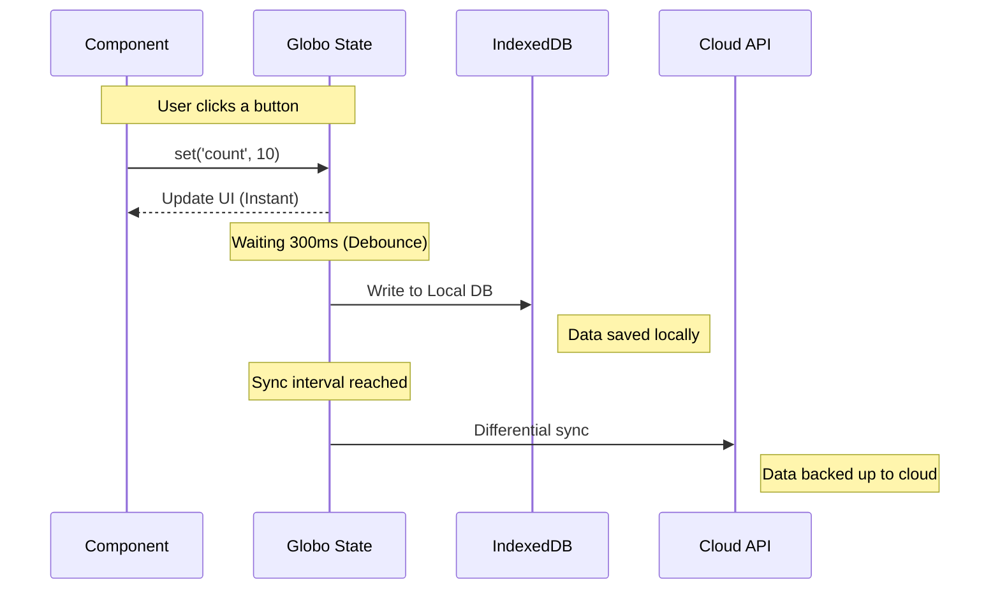

# Local-First Sync - Beyond localStorage

RGS supports advanced storage scenarios beyond basic localStorage, enabling local-first applications with cloud synchronization.

## Storage Technologies Comparison

| Technology | Capacity | Purpose | Plugin |
| :--- | :--- | :--- | :--- |
| **LocalStorage** | ~5MB | Basic UI settings, small profiles | Core (Native) |
| **IndexedDB** | GBs | Offline-first apps, large datasets, logs | `indexedDBPlugin` |
| **Cloud Sync** | Unlimited | Remote backup, cross-device sync | `cloudSyncPlugin` |

## IndexedDB Plugin

For applications that need to store massive amounts of data (gigabytes), standard `localStorage` is not enough. RGS provides the official IndexedDB plugin:

```typescript
import { initState } from '@biglogic/rgs';
import { indexedDBPlugin } from '@biglogic/rgs/plugins';

const store = initState(
  { logs: [], auditTrail: [] },
  {
    namespace: 'audit-logs',
    plugins: [indexedDBPlugin({ maxAge: 30 * 24 * 60 * 60 * 1000 })] // 30 days
  }
);
```

### Benefits of IndexedDB

- **Large capacity**: Store gigabytes of data
- **Async API**: Non-blocking operations
- **Structured data**: Support for complex objects
- **Indexed queries**: Fast lookups by key

## Cloud Sync Plugin

RGS allows you to combine local power with cloud safety. You can store your active data in **IndexedDB** for speed and capacity, while automatically backing it up to a remote database (MongoDB, Firebase, SQL) using the **Cloud Sync Plugin**.

### Why use Cloud Sync?

- **Differential Updates**: Safely sends only what was changed since the last sync.
- **Scheduled or On-Demand**: Sync every 5 minutes automatically, or triggered by a "Save to Cloud" button.
- **Diagnostics**: Track how much data you are syncing and detect errors before they reach the user.

```typescript
import { gstate } from '@biglogic/rgs';
import { cloudSyncPlugin } from '@biglogic/rgs/plugins';

const useStore = gstate(
  { documents: [], settings: {} },
  {
    namespace: 'my-app',
    plugins: [
      cloudSyncPlugin({
        endpoint: 'https://api.example.com/sync',
        interval: 5 * 60 * 1000, // Sync every 5 minutes
        onSync: (changes) => console.log('Synced:', changes),
        onError: (error) => console.error('Sync failed:', error)
      })
    ]
  }
);
```

## Hybrid Persistence: The "Cloud-Cloud" Strategy

### What happens under the hood?



- **Debouncing**: If you update the state 100 times in one second, RGS writes to the disk only once at the end. This saves battery life and browser performance.

- **Selective Persistence**: Don't want to save everything? You can tell RGS which keys to ignore or which ones to save only temporarily.

## Offline-First Architecture

Build applications that work offline and sync when connection is restored:

```typescript
import { initState, watch } from '@biglogic/rgs';
import { indexedDBPlugin, cloudSyncPlugin } from '@biglogic/rgs/plugins';

initState(
  { todos: [], status: 'offline' },
  {
    plugins: [
      indexedDBPlugin(),
      cloudSyncPlugin({
        endpoint: '/api/sync',
        onOnline: () => setState('status', 'online'),
        onOffline: () => setState('status', 'offline')
      })
    ]
  }
);

// Watch for online/offline status
watch('status', (status) => {
  console.log(`App is now: ${status}`);
});
```

## Next Steps

- [Advanced Usage](advanced-usage.md) - More plugin examples
- [Security Features](security-features.md) - Secure your synced data
- [Best Practices](best-practices.md) - Architecture recommendations
