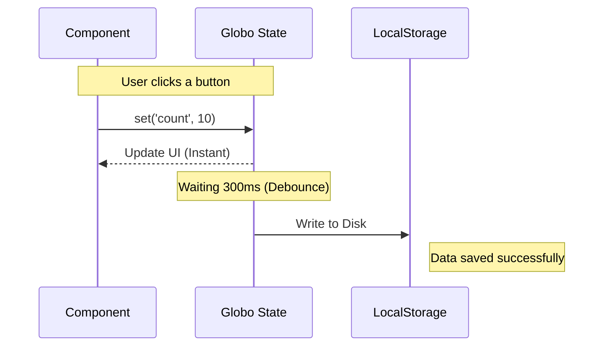

# 🏗️ Chapter 4: Persistence and Safety - Built like a Tank

In a real-world application, state that vanishes on page refresh is a developer failure. RGS handles data saving **intelligently**.

## 💾 Persistence: "Set and Forget"

When you initialize RGS or a Magnetar, you can enable persistence. But it's not a simple `localStorage.set`.

```typescript
initState({
  persist: true,
  storage: 'local' // or 'session' or a custom adapter
});
```

### What happens under the hood?



- **Debouncing**: If you update the state 100 times in one second, RGS writes to the disk only once at the end. This saves battery life and browser performance.
- **Selective Persistence**: Don't want to save everything? You can tell RGS which keys to ignore or which ones to save only temporarily.

## 🛡️ Immutability: The Immer Shield

Have you ever had bugs where state changed "mysteriously" because you mutated an array directly? RGS uses **Immer** at its core (the Stellar Engine).

**Dangerous Code (Standard JS):**

```javascript
const user = store.get('user');
user.permissions.push('admin'); // BOOM! You mutated the original without triggering a re-render.
```

**The RGS Way:**

```javascript
store.set('user', (draft) => {
  draft.permissions.push('admin'); // SAFE! RGS creates an immutable copy for you.
});
```

## 🕵️ Validation: Schema Plugin

Never trust data coming back from the server or saved in the browser 6 months ago. Use the **schemaPlugin**.

```typescript
import { schemaPlugin } from '@biglogic/rgs';
import { z } from 'zod'; // Recommended!

const store = initState();
store._addPlugin(schemaPlugin({
  price: (val) => typeof val === 'number' && val > 0,
  email: (val) => val.includes('@')
}));
```

If anyone tries to `set('price', -50)`, RGS will block the operation and warn you. **Clean State = Happy App.**

---

## 💡 Case Study: The Cart that Never Lost an Item

**Challenge**: User adds products, closes the browser, comes back after two days. The cart must still be there.
**RGS Solution**:

1. Enable `persist: true` in the cart store.
2. Use `createAsyncStore` (Chapter 5) to sync local data with the remote database as soon as a connection is available.
3. Result? 5-star UX.

**Next step:** [Ecosystem and Plugins: Extending the Power](05-plugins-and-extensibility.md)
