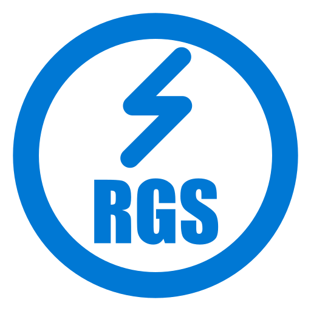

# RGS (Argis) - Visual Studio Code Extension

<p align="center">
  
</p>

## Overview

RGS (Reactive Global State) is a powerful Visual Studio Code extension that provides comprehensive **IntelliSense**, **diagnostics**, and a **State Explorer** sidebar for the RGS state management library.

Whether you're building enterprise React applications or smaller projects, RGS enhances your development workflow with intelligent code completion, real-time error detection, and visual state management tools.

> **What is RGS?** RGS is a React state management library featuring atomic subscriptions, automatic persistence, security-first architecture, and zero-config setup.

---

## Features

### 🧠 Intelligent IntelliSense

| Feature | Description |
|---------|-------------|
| **Autocomplete** | Full API completion for `createStore`, `initState`, `useStore`, `useSyncedState`, and more |
| **Hover Documentation** | Inline documentation on hover for all RGS functions and types |
| **Code Snippets** | Pre-built templates for common patterns |
| **Go to Definition** | Navigate directly to store definitions |

### 🔍 Real-Time Diagnostics

Automatically detects issues in your RGS code:

- ⚠️ **Warnings**: Undefined values, missing namespaces
- 💡 **Hints**: Type safety suggestions (use selectors instead of string keys)
- 🔒 **Security**: Detection of dangerous key assignments (`__proto__`, `constructor`, `prototype`)

### 📊 State Explorer Sidebar

A powerful sidebar with four views:

1. **Welcome** - Quick access to extension features and workspace analysis
2. **State Explorer** - Visual tree of all stores in your project
3. **State Properties** - Detailed view of each store's properties with type, default values, and attributes (persisted, encrypted, readonly)
4. **Information** - Documentation and help resources

### 🎨 Syntax Highlighting

Automatic highlighting of RGS API functions in your code:
- `createStore` | `initState` | `useStore` | `useSyncedState` | `getStore` | `destroyState` | `triggerSync`

---

## Installation

### From VSCode Marketplace

1. Open VSCode
2. Go to **Extensions** (Ctrl+Shift+X / Cmd+Shift+X)
3. Search for **"RGS (Argis)"**
4. Click **Install**

### From VSIX File

1. Download the `.vsix` file from [Releases](https://github.com/biglogic/rgs/releases)
2. Open VSCode
3. Go to **Extensions** → **⋮** → **Install from VSIX**

---

## Quick Start

### 1. Analyze Your Workspace

Press `Ctrl+Shift+P` / `Cmd+Shift+P` and run:
```
RGS: Analyze Workspace
```

This scans your project for RGS stores and displays them in the State Explorer.

### 2. Create Your First Store

```typescript
import { createStore } from '@biglogic/rgs'

// Create a store with automatic persistence
const useAppStore = createStore({
  state: {
    user: null,
    theme: 'light',
    notifications: [] as string[]
  },
  persist: true
})
```

### 3. Use in Components

```typescript
import { useStore } from '@biglogic/rgs'

function UserProfile() {
  const [user] = useStore('user')
  const [theme, setTheme] = useStore('theme')

  return <div>{user?.name}</div>
}
```

---

## Configuration

Access settings via **File → Preferences → Settings** and search for `rgs`:

| Setting | Default | Description |
|---------|---------|-------------|
| `rgs.enableDiagnostics` | `true` | Enable real-time diagnostics for RGS code |
| `rgs.enableAutocomplete` | `true` | Enable autocomplete for RGS API |
| `rgs.enableHover` | `true` | Enable hover documentation |
| `rgs.enableSnippets` | `true` | Enable code snippets |
| `rgs.showTestStores` | `true` | Show test stores in State Explorer |
| `rgs.trace.server` | `off` | Trace server communication |

---

## Commands

| Command | Description |
|---------|-------------|
| `RGS: Welcome` | Show RGS welcome page |
| `RGS: Analyze Workspace` | Scan project for RGS stores |
| `RGS: Show Store Details` | View detailed store information |
| `RGS: Go to Store Definition` | Navigate to store definition |

---

## Supported Languages

- TypeScript (`.ts`, `.tsx`)
- JavaScript (`.js`, `.jsx`)

---

## Resources

- 📖 [Documentation](https://biglogic.github.io/rgs/)
- 📦 [npm Package](https://www.npmjs.com/package/@biglogic/rgs)
- 🐛 [GitHub Issues](https://github.com/biglogic/rgs/issues)
- 💬 [Discussions](https://github.com/biglogic/rgs/discussions)

---

## License

MIT License - see [LICENSE](LICENSE) file.

---

<p align="center">
  <strong>Built with ❤️ by Biglogic</strong>
</p>
